# mpweixinA052
mpweixinA052高校毕业生离校管理微信小程序LW+PPT
 
## 查看主页获取源码

### 一、作品包含

源码+数据库+设计文档万字+PPT+全套环境和工具资源+部署教程

### 二、项目技术

前端技术：Html、Css、Js、Vue、Element-ui、Uniapp

数据库：MySQL

后端技术：Java、Spring Boot、MyBatis

  

### 三、运行环境

开发工具：IDEA/eclipse + 微信开发者工具

数据库：MySQL5.7

数据库管理工具：Navicat10以上版本

环境配置软件： JDK1.8+Maven3.6.3

前端Nodejs：14

### 四、项目介绍
项目编号：mpweixinA052

在当今数字化时代，高校毕业生离校管理面临着诸多挑战与机遇。随着毕业生数量的不断增加，传统的离校手续办理方式显得繁琐且效率低下。为了更好地服务毕业生，提高离校管理的效率和便捷性，高校毕业生离校管理微信小程序应运而生。这款小程序以其便捷的操作、高效的服务和全面的功能，为毕业生和高校管理部门搭建了一座沟通的桥梁，让毕业生能够轻松完成离校手续，开启人生新的篇章。

前台学生功能：首页、校园公告、我的、离校申请、物流信息、钥匙归还、图书归还、欠费信息、催缴信息。

后台分为管理员、财务人员、图书管理员、宿管员、教务人员
管理员的功能：首页、个人中心、学生管理、教务人员管理、宿管员管理、图书管理员管理、财务人员管理、离校申请管理、物流信息管理、钥匙归还管理、图书归还管理、欠费信息管理和催缴信息管理、系统管理。
财务人员的功能：首页、个人中心、欠费信息管理、催缴信息管理。
图书管理员的功能：首页、个人中心、图书归还管理。
宿管员的功能：首页、个人中心、销题归还管理。
教务人员的功能：首页、个人中心、离校申请管理、物流信息管理。

### 五、运行截图

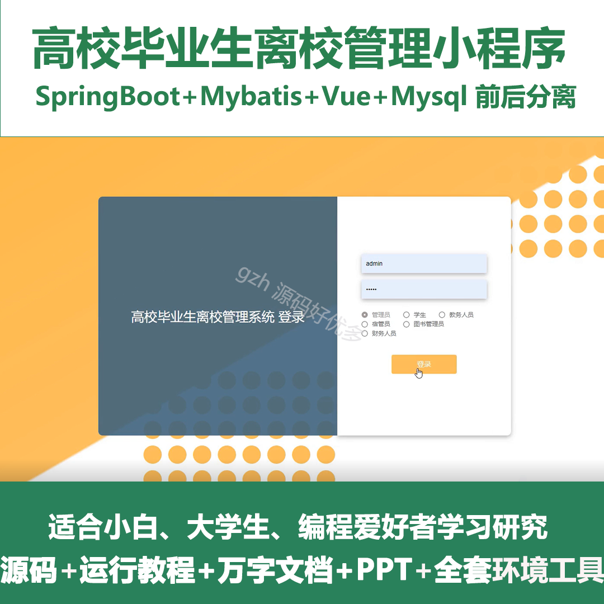
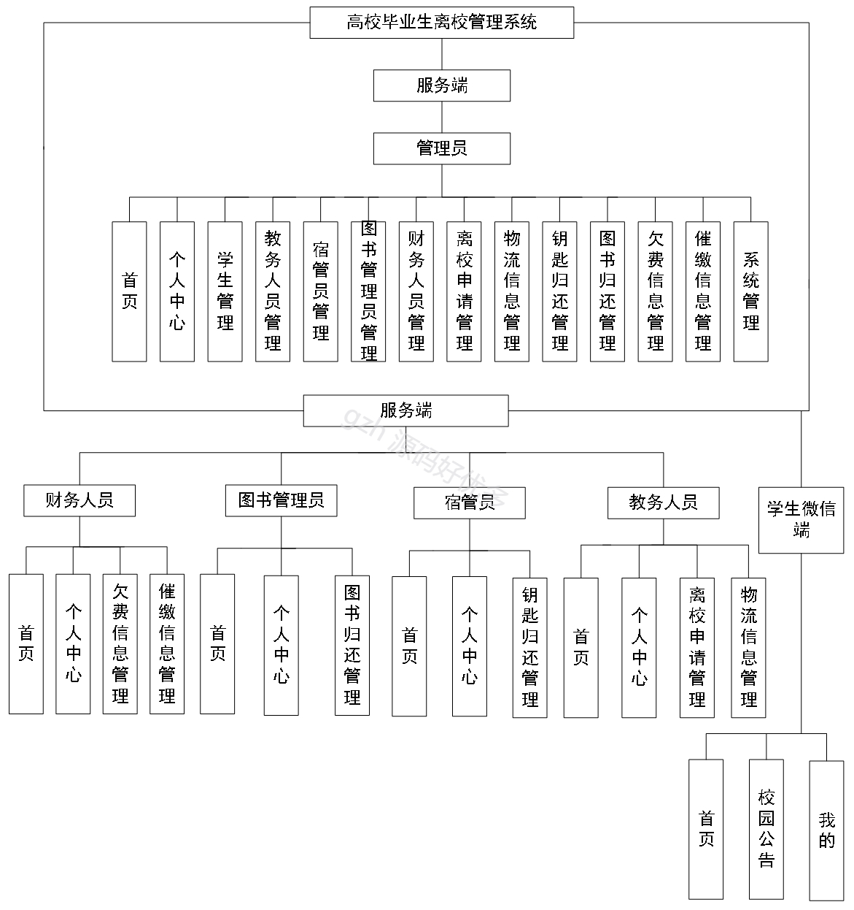
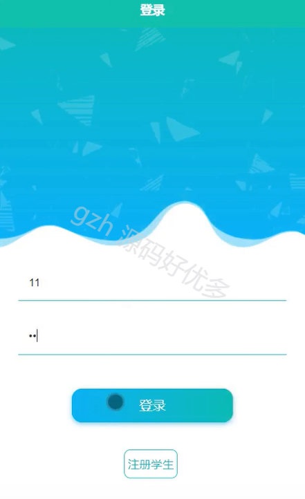
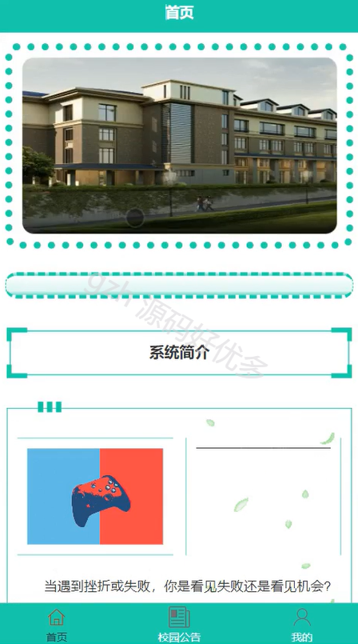
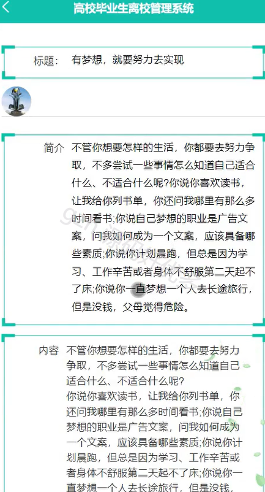
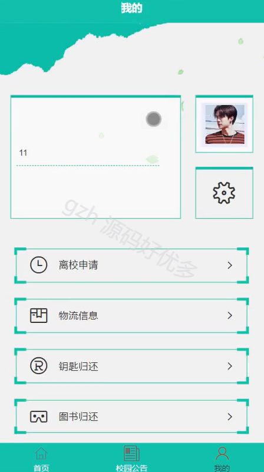
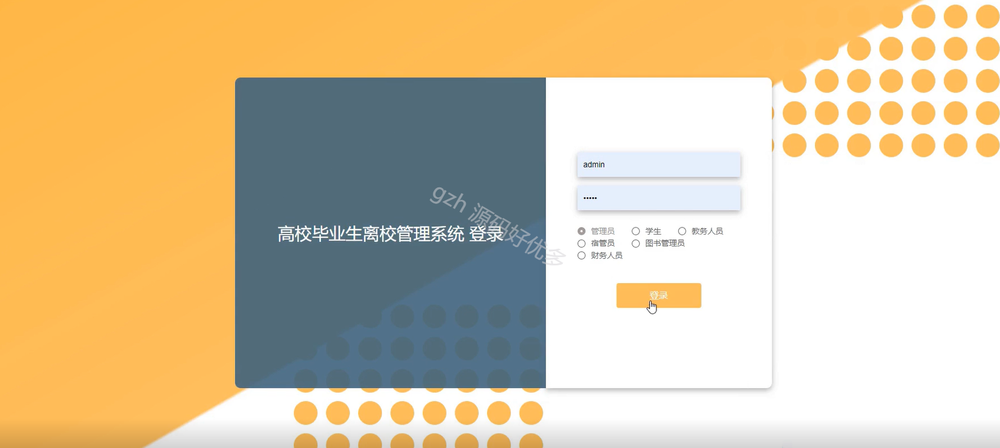
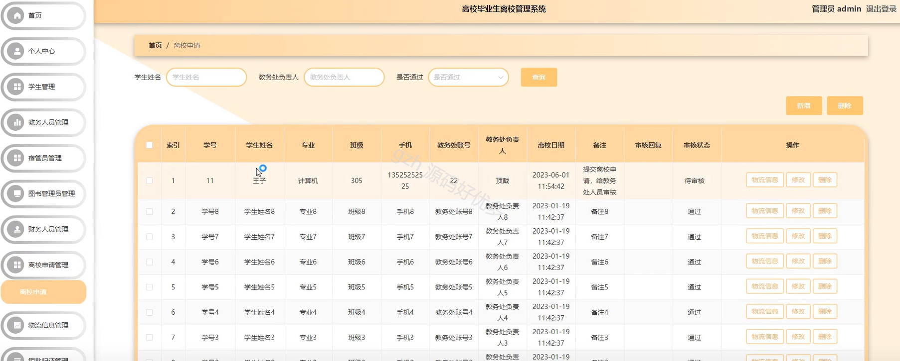
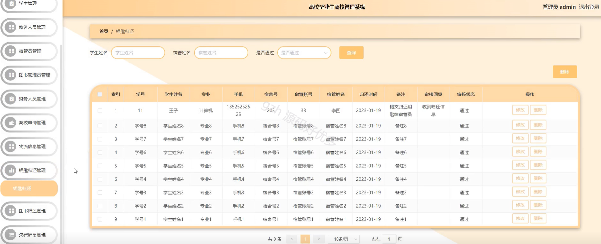
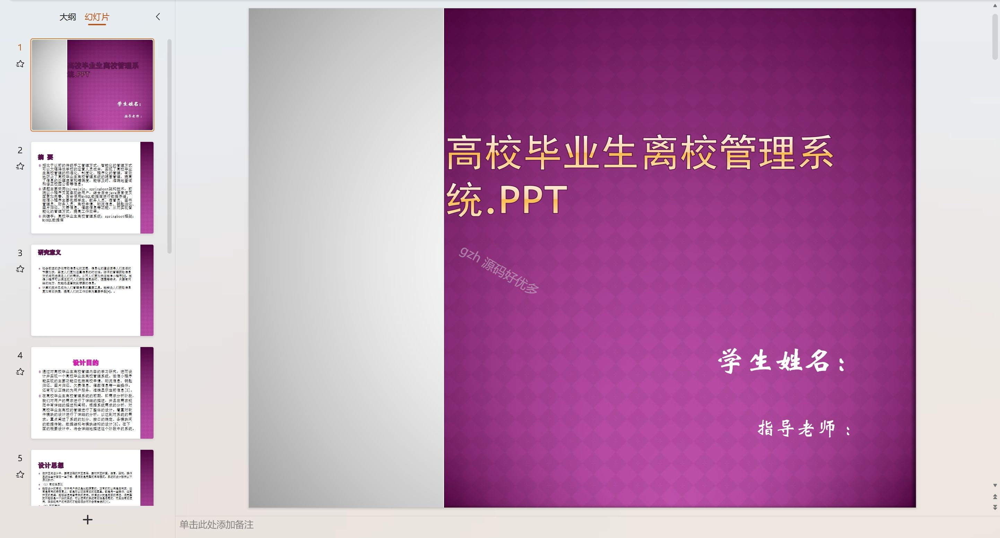
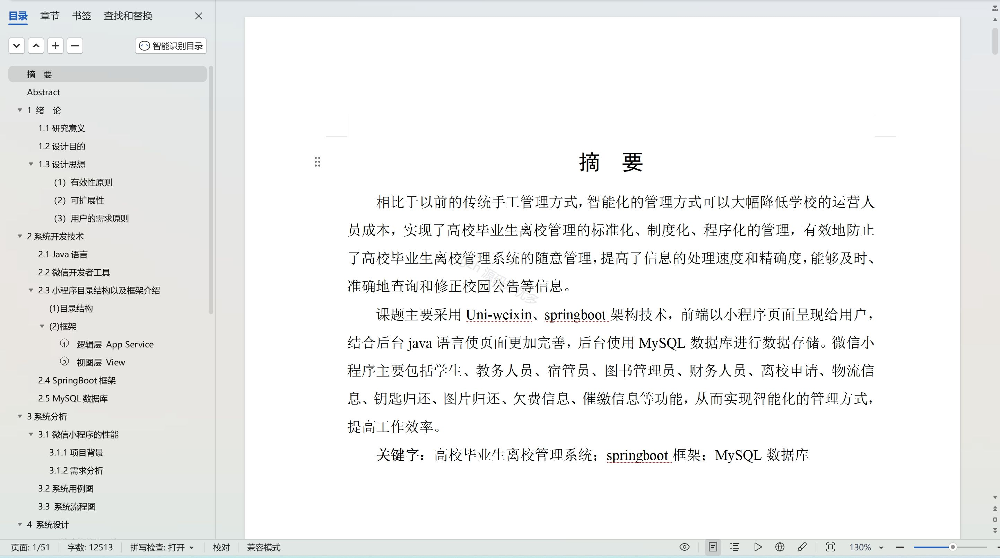

  
